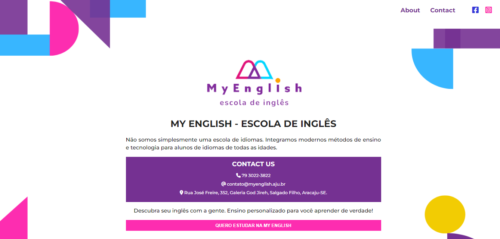

 
<h1 align="center"><b>My English - Escola de inglês</b></h1>

## <b>Apresentação 🎥</b>

### Landing page criada para a <b>My English - Escola de inglês</b>, localizada no bairro Salgado Filho, Aracaju-SE.

 

## <b>Proposta 📑</b>

### Página criada para divulgação da escola e captação de novos clientes.

 

## <b>Desing 🎨</b>

#### A página foi criada para uso em desktop e mobile, para isso o projeto foi criado sob o conceito de mobile first.

 

### <b>Desktop design</b> 💻

 

 

### <b>Mobile design</b> 📱

 

 

## <b>Tecnologias utilizadas 🔧</b>

- HTML
- CSS
- JS
   

## <b>Links 🔗</b>

Clique aqui para acessar o deploy da página:
[My English - Escola de Inglês](https://osmarviana.github.io/escola-de-ingles/)

 

# <b>Autor</b> 🧐

## <b>Osmar Viana Torres</b>
 

 
  
   
  
   
  
   
  
   

